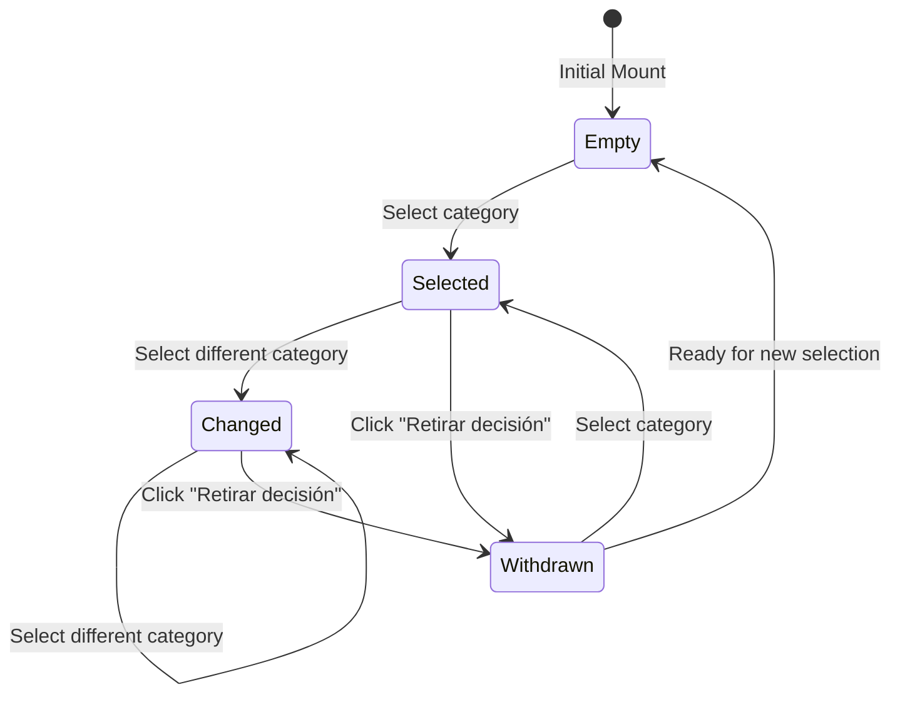

# Spec: Browser-Local Human Editorial Decision Boundary and Exports

## Purpose

This specification defines the architecture, state machine, validation rules, JSON-LD Schema.org mapping, and browser-local export mechanisms for the human editorial decision boundary in `informa-t`.

The editorial decision interface enables professional journalists and fact-checkers to formulate, document, modify, withdraw, and export an auditable editorial decision on electoral claims. Under strict editorial control principles, the application **never** permits model proposals, consensus calculations, index metrics, or automated analysis to pre-populate, suggest, select, or complete any portion of an editorial decision.

## 1. Decision State Machine

The human editorial decision lifecycle operates as a deterministic, browser-local state machine with four defined states and explicit transitions:

### States

1. **`Empty` (Initial / Reset)**:
   - `category`: `null`
   - `author`: string (may be in-progress text or empty)
   - `justification`: string (may be in-progress text or empty)
   - `isExportReady`: `false`
   - Initial mount always starts in `Empty`.

2. **`Selected`**:
   - `category`: Valid `Category` (`Cierto`, `Falso`, `Impreciso`, `Engañoso`, `Sátira`, `Inverificable`).
   - Triggered when moving from `category === null` to any valid category.
   - Appends an editorial event of type `selected`.

3. **`Changed`**:
   - `category`: Valid `Category` differing from the previously selected category.
   - Triggered when switching from one valid category to another without resetting to empty first.
   - Appends an editorial event of type `changed`.

4. **`Withdrawn`**:
   - `category`: Reset to `null`.
   - Triggered when the user invokes the explicit `Retirar decisión` (Withdraw) action.
   - Appends an editorial event of type `withdrawn`.
   - Transition returns the state to `Empty` (with `category: null`), preserving or resetting editorial fields as appropriate.



## 2. Required Fields and Client-Side Export Gating

### Validation Rules

An editorial decision is valid and ready for export (`isExportReady === true`) if and only if all three mandatory fields are actively provided by the human editor:

1. **`author`**: Editorial author name (`author.trim().length > 0`). Must not be empty or whitespace-only.
2. **`category`**: One of the six permitted closed categories (`isCategory(category) === true`):
   - `Cierto`
   - `Falso`
   - `Impreciso`
   - `Engañoso`
   - `Sátira`
   - `Inverificable`
3. **`justification`**: Editorial rationale and factual argument (`justification.trim().length > 0`). Must not be empty or whitespace-only.

### Export Gating

- **Disabled State**: When any of `author`, `category`, or `justification` is missing or empty, both export buttons (`Exportar ClaimReview` and `Exportar traza editorial`) are strictly disabled (`disabled={true}`, `aria-disabled="true"`).
- **Validation Messages**: The UI displays contextual Latin American Spanish feedback indicating which fields remain incomplete (e.g. `Ingrese el nombre del periodista o editor`, `Seleccione una categoría editorial`, `Ingrese la justificación editorial fundamentada`).
- **No Auto-Completion**: Automated systems (model proposals, consensus, heuristic indices) must not fill or suggest any default values for author, category, or justification.

## 3. Local Editorial Event Semantics vs. Analysis Provenance

### Editorial Event Model

```typescript
export type EditorialEventType = "selected" | "changed" | "withdrawn";

export interface EditorialEvent {
  id: string;
  type: EditorialEventType;
  timestamp: string; // ISO 8601 UTC
  category: Category | null;
  previousCategory: Category | null;
  author: string;
  justificationSummary?: string;
  details: string;
}
```

### Event Triggers

1. **`selected`**: Fired when a category is chosen while `previousCategory === null`.
2. **`changed`**: Fired when `newCategory !== previousCategory` and `previousCategory !== null`.
3. **`withdrawn`**: Fired when the journalist clicks `Retirar decisión`. `category` becomes `null`, and `previousCategory` records the category that was withdrawn.

### Strict Provenance Isolation

- **Browser-Local Only**: Editorial events are held solely in browser-local state. They are never transmitted to backend ingestion endpoints or stored in server database tables.
- **Strict Separation from Analysis Trace**: `caseData.traceEvents` represents pipeline analysis provenance (Ingesta, Extracción, Análisis, Consenso). Editorial events are **never** appended to, merged into, or substituted for `caseData.traceEvents`.
- **Audit Export**: The downloaded editorial trace artifact contains only human editorial actions (`selected`, `changed`, `withdrawn`) and the final human decision state.

## 4. Schema.org ClaimReview JSON-LD Mapping

The ClaimReview builder generates valid Schema.org JSON-LD formatted metadata adhering to the fact-checking standard.

### Field Mapping

| Schema.org Property | Type | Source / Value |
|---------------------|------|----------------|
| `@context` | String | `"https://schema.org"` |
| `@type` | String | `"ClaimReview"` |
| `datePublished` | String | ISO 8601 timestamp of editorial decision |
| `url` | String | Auditable permalink or local case URL |
| `author` | `Person` or `Organization` | `{ "@type": "Person", "name": humanDecision.author }` |
| `claimReviewed` | String | Extracted claim title or summary |
| `reviewRating` | `Rating` | `{ "@type": "Rating", "ratingValue": ratingNumeric, "bestRating": 5, "worstRating": 1, "alternateName": humanDecision.category }` |
| `reviewBody` | String | `humanDecision.justification` |
| `itemReviewed` | `Claim` | Single claim object |
| `hasPart` | `Claim[]` | Array of `Claim` objects when evaluating multiple claims |

### Single Claim Mapping

When a single excerpt/claim is evaluated:

```json
{
  "@context": "https://schema.org",
  "@type": "ClaimReview",
  "datePublished": "2026-08-15T12:00:00.000Z",
  "url": "https://informa-t.local/cases/a1",
  "author": {
    "@type": "Person",
    "name": "María González (Periodista)"
  },
  "claimReviewed": "Aumento del padrón electoral sin auditoría",
  "reviewRating": {
    "@type": "Rating",
    "ratingValue": 2,
    "bestRating": 5,
    "worstRating": 1,
    "alternateName": "Impreciso"
  },
  "reviewBody": "La declaración confunde las estimaciones preliminares con el padrón consolidado oficial.",
  "itemReviewed": {
    "@type": "Claim",
    "name": "Aumento del padrón electoral sin auditoría",
    "text": "El padrón electoral aumentó un 40 en los últimos dos meses sin auditoría técnica independiente.",
    "author": {
      "@type": "Person",
      "name": "Intervención en debate público"
    },
    "datePublished": "Registro primario 00:14:22",
    "appearance": "Audio / Transcripción verificada"
  }
}
```

### Multiple Claims Mapping (`hasPart`)

When reviewing multiple claims within the case, each claim is structured as an individual `Claim` object and linked via `hasPart`:

```json
{
  "@context": "https://schema.org",
  "@type": "ClaimReview",
  "datePublished": "2026-08-15T12:00:00.000Z",
  "url": "https://informa-t.local/cases/a1",
  "author": {
    "@type": "Person",
    "name": "María González (Periodista)"
  },
  "claimReviewed": "Evaluación integral de declaraciones sobre el padrón y transmisión electoral",
  "reviewRating": {
    "@type": "Rating",
    "ratingValue": 2,
    "bestRating": 5,
    "worstRating": 1,
    "alternateName": "Impreciso"
  },
  "reviewBody": "Análisis conjunto de los extractos del debate público y conferencias de prensa.",
  "hasPart": [
    {
      "@type": "Claim",
      "name": "Aumento del padrón electoral sin auditoría",
      "text": "El padrón electoral aumentó un 40 en los últimos dos meses sin auditoría técnica independiente.",
      "author": {
        "@type": "Person",
        "name": "Intervención en debate público"
      },
      "datePublished": "Registro primario 00:14:22",
      "appearance": "Audio / Transcripción verificada"
    },
    {
      "@type": "Claim",
      "name": "Actas de escrutinio y verificación criptográfica",
      "text": "Las actas de escrutinio preliminar no cuentan con código de verificación criptográfica según el protocolo electoral.",
      "author": {
        "@type": "Person",
        "name": "Conferencia de prensa"
      },
      "datePublished": "Registro primario 00:32:05",
      "appearance": "Declaración en video / Registro de medios"
    }
  ]
}
```

## 5. Separate Exports and Artifact Generation

The application provides two separate, non-overlapping client-side download actions:

1. **`Exportar ClaimReview (JSON-LD)`**:
   - Filename: `claimreview-[caseId]-[timestamp].json` (or `claimreview-[caseId].json`).
   - Content: Validated Schema.org ClaimReview JSON-LD structure.
   - MIME Type: `application/ld+json;charset=utf-8`.
   - Data Source: Strictly human decision (`author`, `category`, `justification`) + claim identity/quote metadata.

2. **`Exportar traza editorial (JSON)`**:
   - Filename: `traza-editorial-[caseId]-[timestamp].json` (or `editorial-trace-[caseId].json`).
   - Content: Complete chronological audit record of human interactions (`selected`, `changed`, `withdrawn`), author identity, timestamp history, and active decision state.
   - MIME Type: `application/json;charset=utf-8`.
   - Data Source: Browser-local `EditorialEvent[]` log.

### Prohibitions

1. **No Autonomous Verdicts**: Model proposals and consensus values must never complete or pre-select editorial decisions.
2. **No Data Leakage**: Pipeline trace logs and internal model prompts are excluded from the exported ClaimReview.
3. **No Auto-Submit**: No network requests are made upon decision change or export.
